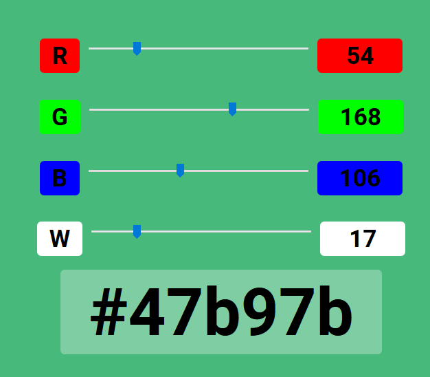

# ESP8266-LED-RGB-Slider

This package of html, css and javascript lets you control your RGB-LED strips dynamically by just dialing in the colours from your phone
or any other device that can run a browser. One benefit is that you don't need any third party service or a constant internet connection
like in the case with some IoT solutions!

## Idea

Dialing in the desired colour from a web based platform by just using hmtl and javascript.

## Setup & Functions

In this project I used an Adafruit Feather Huzzah ESP8266 which controls a RGBW LED strip through N-channel MOSFET's. The microcontroller is connected to the home WiFi network and can be controlled from any device that can run a browser. 

A parts list and more detailed descriptions of the project (schematics, PCB desgin, etc.) can be found on https://www.aufbauprinzip.com/blog/

### Functions

* web based interface (no internet connection needed) 
* background color of web interface changes according to colour setting

## Getting Started

